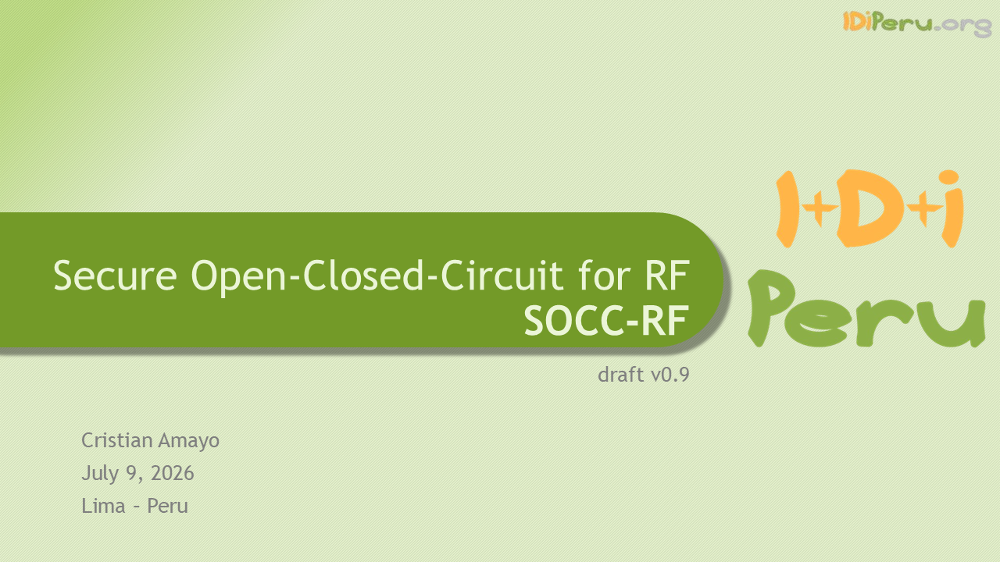
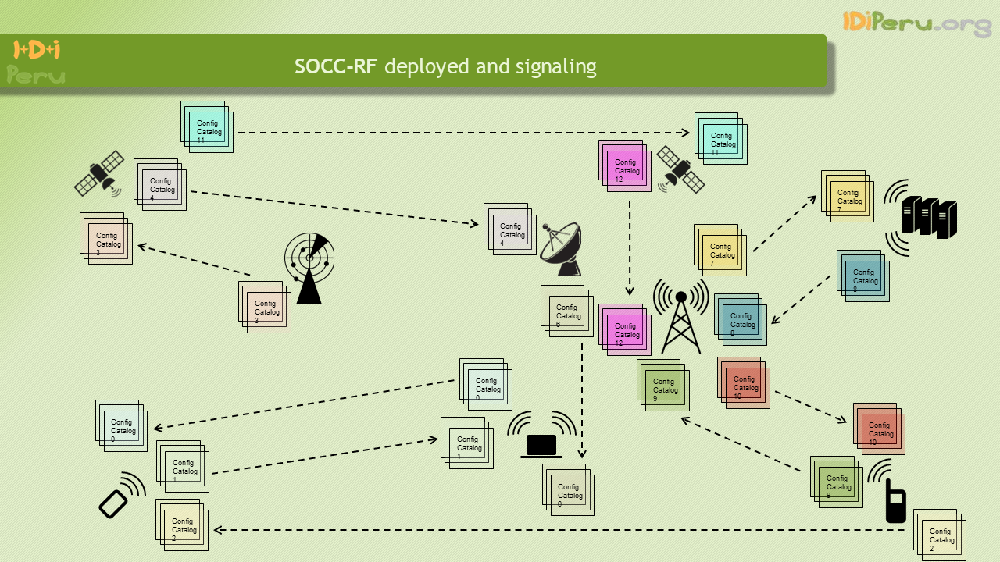

# RFCryptoFramework

[![Contributors][contributors-shield]][contributors-url]
[![Forks][forks-shield]][forks-url]
[![Stargazers][stars-shield]][stars-url]
[![Issues][issues-shield]][issues-url]
[![Unlicense License][license-shield]][license-url]
[![LinkedIn][linkedin-shield]][linkedin-url]

<!-- PROJECT LOGO -->
 

  

  <h3 align="center">Jumpin’ Jack Simplex CX Framework</h3>

  

    Encryption framework for secure RF TX/RX.
     
    <a href="https://github.com/IDiPeru/RFCryptoFramework/tree/main/v02"><strong>Explore the docs »</strong></a>
     
     
    <a href="https://github.com/IDiPeru/RFCryptoFramework/issues/new?labels=bug&template=bug-report---.md">Report Bug</a>
    &middot;
    <a href="https://github.com/IDiPeru/RFCryptoFramework/issues/new?labels=enhancement&template=feature-request---.md">Request Feature</a>
  

<!-- TABLE OF CONTENTS -->

  
Table of Contents

  <ol>
    <li>
      <a href="#">Features and resources</a>
    </li>
    <li>
      <a href="#">Dev Envs</a>
    </li>
    <li>
      <a href="#">Device runtime</a>
    </li>
    <li>
      <a href="#">Topology</a>
      <ul>
        <li><a href="#">P2P vs Controller</a></li>
        <li><a href="#">Grid</a></li>
        <li><a href="#">Cluster</a></li>
      </ul>
    </li>
    <li>
      <a href="#">Transmission</a>
      <ul>
        <li><a href="#">Non-scheduled</a></li>
        <li><a href="#">Scheduled</a></li>
      </ul>
    </li>
    <li>
      <a href="#">In-revision</a>
      <ul>
        <li><a href="#">additional configuration: amplitude, frequency, band</a></li>
      </ul>
    </li>
  </ol>

(<a href="#readme-top">back to top</a>)

<!-- LICENSE -->
## License
<a href="https://github.com/IDiPeru/RFCryptoFramework">JJSCF</a> © 2025 by <a href="https://www.linkedin.com/in/cristianamayo/">Cristian Amayo</a> (cristian.amayo@idiperu.org) is licensed under <a href="https://github.com/IDiPeru/RFCryptoFramework/blob/main/LICENSE">Apache 2.0</a>

(<a href="#readme-top">back to top</a>)

<!-- CONTACT -->
## Contact
Cristian Amayo - https://www.linkedin.com/in/cristianamayo/ - cristian.amayo@idiperu.org

Project Link: https://github.com/IDiPeru/RFCryptoFramework

(<a href="#readme-top">back to top</a>)

<!-- MARKDOWN LINKS & IMAGES -->
[contributors-shield]: https://img.shields.io/github/contributors/IDiPeru/RFCryptoFramework?style=for-the-badge
[contributors-url]: https://github.com/IDiPeru/RFCryptoFramework/graphs/contributors
[forks-shield]: https://img.shields.io/github/forks/IDiPeru/RFCryptoFramework?style=for-the-badge
[forks-url]: https://github.com/IDiPeru/RFCryptoFramework/network/members
[stars-shield]: https://img.shields.io/github/stars/IDiPeru/RFCryptoFramework?style=for-the-badge
[stars-url]: https://github.com/IDiPeru/RFCryptoFramework/stargazers
[issues-shield]: https://img.shields.io/github/issues/IDiPeru/RFCryptoFramework?style=for-the-badge
[issues-url]: https://github.com/IDiPeru/RFCryptoFramework/issues
[license-shield]: https://img.shields.io/github/license/IDiPeru/RFCryptoFramework?style=for-the-badge
[license-url]: https://github.com/IDiPeru/RFCryptoFramework/blob/main/LICENSE
[linkedin-shield]: https://img.shields.io/badge/-LinkedIn-black.svg?style=for-the-badge&logo=linkedin&colorB=555
[linkedin-url]: https://www.linkedin.com/company/idiperu
